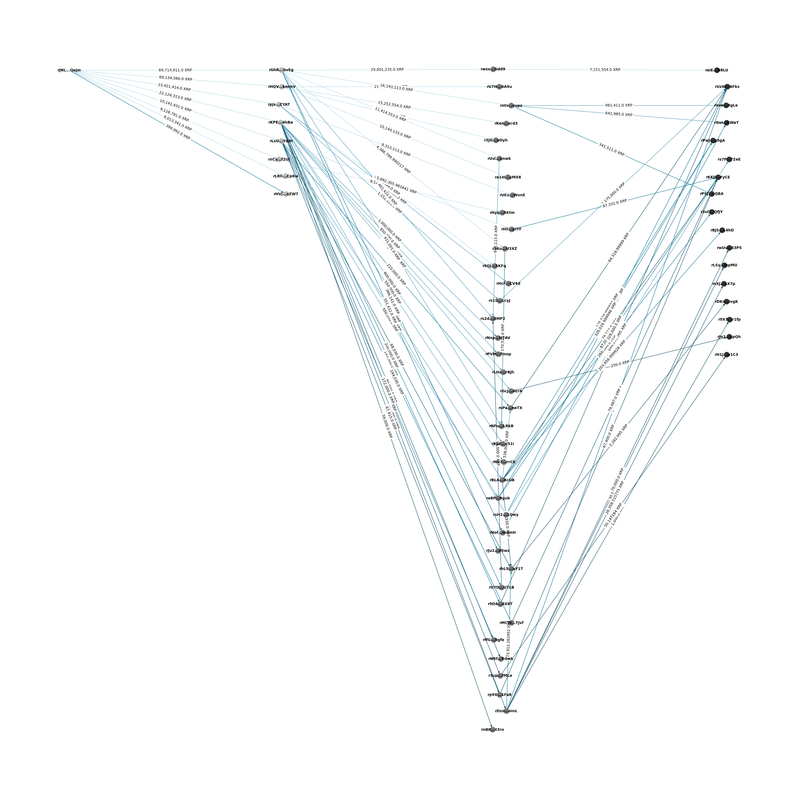

# Hack Tracking Project

Developed as a fun side project inspired by my internship at DeepBlue, the stablecoin issuer, this project tracks and visualizes cryptocurrency transactions, focusing on the flow of funds from an initial account over a specified period. Initially developed for tracking XRP transactions using the XRPSCAN API, it has been adapted to track Ethereum transactions using the Etherscan API, and I plan to potentially expand the project to different chains and be able to track cross chain transactions.

## Features

- **Recursive Transaction Tracing:** Traces transactions from an initial account to a specified depth.
- **Date Range Filtering:** Filters transactions within a specified date range.
- **Graph Visualization:** Visualizes the flow of transactions in a directed graph, highlighting the amount transferred.

## Requirements

- Python 3.6+
- Libraries:
  - `requests`
  - `networkx`
  - `matplotlib`
  - `numpy`

the following image is an example of using the xrp tracker to trace the ripple hack. The darker lines mean more money. Also, I shortened the addresses in the diagram for cleanliness of the tracking but the full addresses can be viewed on the diagram by removing the shortening function.




(Ensure you have valid API keys for XRPSCAN and Etherscan. Replace API_KEY in the script with your Etherscan API key.)
To install the dependencies, run:

```bash
pip install requests networkx matplotlib numpy

 
